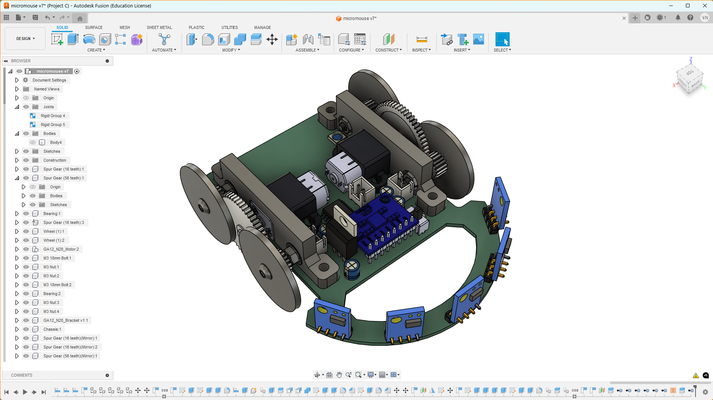

# NeuralNetwork_Based_AutonomousCar

## Project Overview
This project focuses on developing an autonomous car system powered by neural networks (NN). Inspired by the design architecture of micromouse, the car is designed to navigate autonomously using deep learning techniques to enable key functionalities such as perception, path planning, and control.

## Theoretical Basis
The project leverages deep learning and neural network models to enable the autonomous functionalities of the car. The neural network processes real-world sensor data to make real-time decisions for navigating the environment.

## Approach
The project timeline is divided into several stages:
1. **Concept Development**: Initial phase where the concept was developed.
2. **Gamepad PCB Design**: Creation of the gamepad hardware to control the car.
3. **Autonomous Car Design**: Currently in progress, focusing on the car's hardware and software integration.
4. **Neural Network Training**: Future phase where the model will be trained.
5. **Documentation**: Final phase to document the project.

## Hardware
- **ESP32-S3 Super Mini**: Main microcontroller used in the car.
- **GY87 9-DOF IMU**: Inertial measurement unit for orientation and motion sensing.
- **5 VL53L0X Sensors**: Distance measurement sensors for mapping the environment.
- **L293DD Motor Driver**: Controls the motors of the car.
- **GA12 N20 Motor**: Motor with a step-up gearbox of 56:16 for movement.

## Software Architecture
- **Data Collection**: Using the gamepad (now replaced by computer control) to navigate the car in a physical map with walls. The sensors collect data and transmit it to the ESP32-S3 on the computer for storage.
- **Machine Learning Training**: Utilizing Python and TensorFlow to train the neural network model.
- **Deployment**: Importing the trained model configurations to the car for autonomous navigation.

## Project Progress
The project is currently in the autonomous car design phase. However, the gamepad hardware has encountered a significant issue. Due to time constraints, the gamepad will be replaced with an external ESP32-S3 connected to a computer. This ESP will communicate with the car via BLE, allowing control through a laptop.

### Milestone Pictures
- **Micromouse Design Inspiration**
  
  
  
- **Gamepad PCB**
  
  
  
  

## Additional Information
The gamepad PCB encountered a hardware issue that cannot be fixed in time. As a workaround, we will use an external ESP32-S3 connected to the computer to control the car via BLE.

## ML Training Procedure
1. **Collecting Data**: Create a physical map with walls and use the gamepad (now our computer) to control the car. The 5 VL53L0X sensors onboard will collect map data, transmit them to the ESP on the computer, and store them.
2. **Training the Model**: Use Python with TensorFlow library to train the neural network model.
3. **Deployment**: Import the trained model configurations to the car and let it navigate autonomously.

---

*Author: pacman314159*
